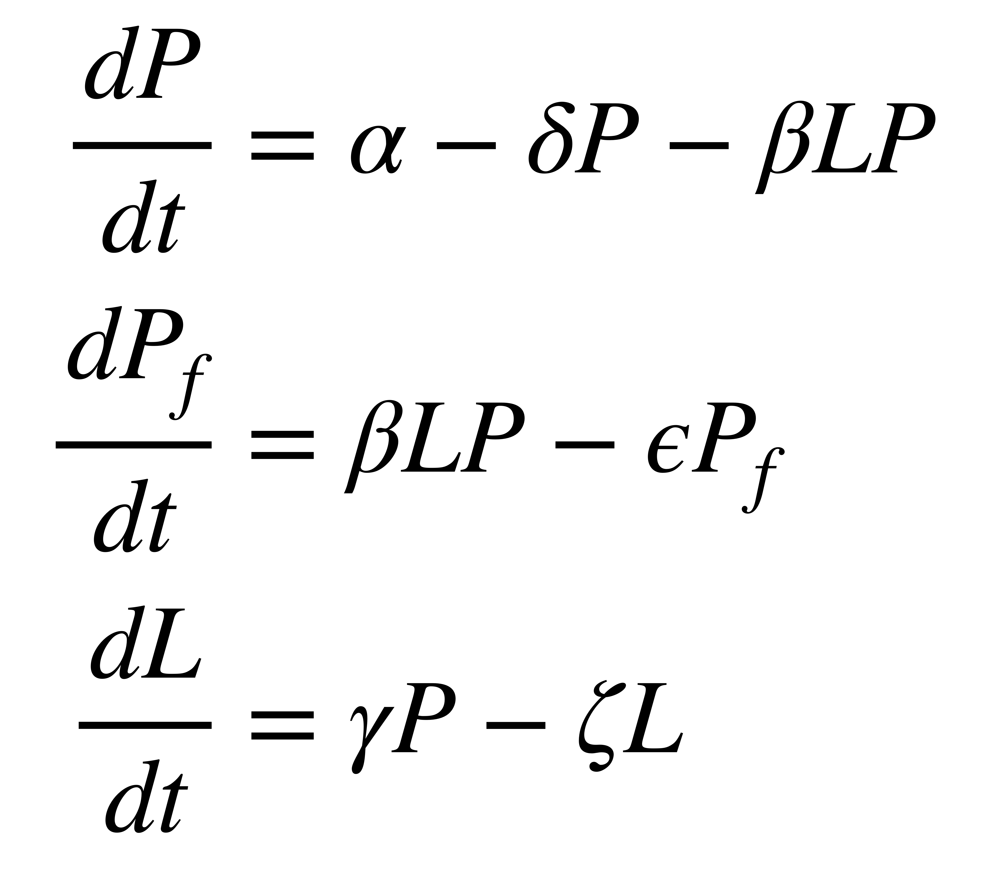
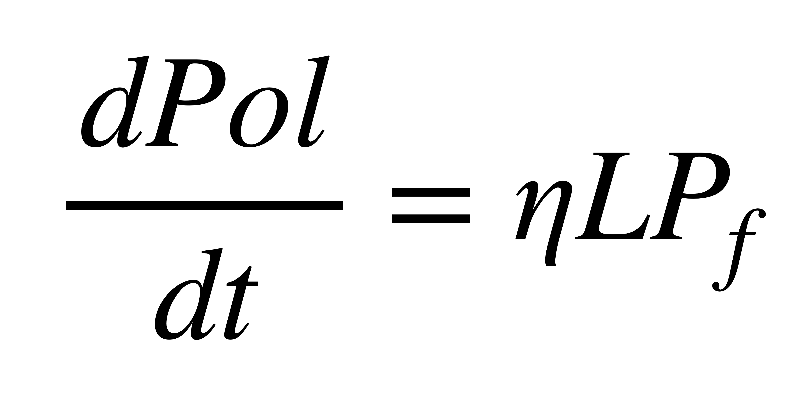
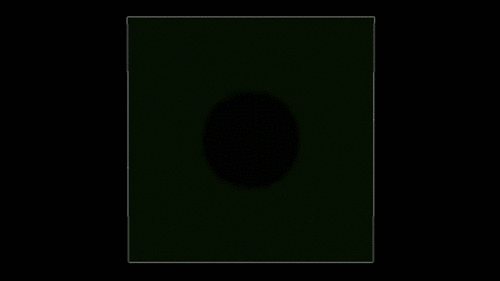

# BacillaFilla model

Implementation of BacillaFilla model in Netlogo using different ordinary differential equations (ODEs). BacillaFilla is an genetic engineered bacteria designed to produce "concrete" in the building cracks when they are exposed to light. This bacteria was created by the [*igem*](https://igem.org/Main_Page) team of [Newcastle](https://2010.igem.org/Team:Newcastle/solution).

The model is interactive and holes can be created manually to observe how they become closed due to the "glue" produced by the bacteria. An example of a crack that can be repaired is shownin the following image.

    

#### Genetic circuit dynamics

The following scheme shows the process to be modeled:

    

In this scheme, the photosensitive protein is ideal. It has two domains which are active depending on the light of the environment.

1. In the scenario of few light in the environment, the protein will work as a transcription factor of the lactone.
2. Lactone will be released to the environment, reaching bacteria from the other side of the plate (light).
3. With presence of light and lactone, the other domain will be phosphorylated. Now, this phosporylated domain can bind together the genome of the bacteria, promoting the transcription of the polysaccharide (glue).
4. The polusaccharide is released to the environment, initiation the repairing of the crack.

The dynamics of the system are described by four different ODEs:

    

where *P* is the concentration of the protein, *Pf* is the concentration of the phosporylated protein and *L* is the concentration of lactone. The equation for the dynamics of the polyssacharide are described by the following ODE:

    

The model integrates 7 different parameters denoting the rate of creation or elimination of the component (growth or decay of the concentration).

#### Performance
In the presence of a crack, the lactone begins to be released in the side of the plate with no light (black):

    

Once the diffussion has begun, bacteria in the other side of the plate begin to produce polyssacharide and the crack (white) begins to be repaired:

    

#### Installation
The code has been tested in Netlogo 3D 6.0.4 2019a. To run the code, open the file and follow the instructions. Press *Setup* to initiate the environment. Press the button for the crack shape to be simulated. Finally, press *evolution* to run the simulation. Move the sliders to change any parameter of the model.